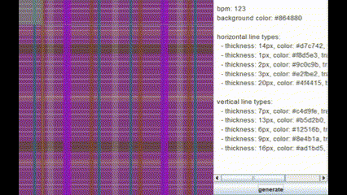

# plaid-drum-machine

---
## Setup
Clone the repository:

`git clone https://github.com/zackjwilk/plaid-drum-machine.git`

If you'd like, replace or add any sample sounds in the samples folder and edit the `SAMPLE_PATHS` array in `PlaidDrumMachine.java` accordingly.

Run `PlaidDrumMachine.java` (make sure it's in the same directory as the `samples` folder) and generate an endless possibility of patterns!

## How it works
plaid-drum-machine generates random plaid patterns by generating a random background color and creating 2-5 types of both horizontal and vertical lines, varying in color, thickness, and transparency. These attributes then determine the drum pattern generated to accompany it. For example, the brighter the background color, the higher the BPM. Thicker lines will produce samples like kicks and snares, while thinner lines will produce samples like rides and cowbells. The more opaque a line is, the louder the sample associated with it will be. The brighter the color of a line is, the higher the pitch of the sample associated with it will be. A square cyclically moves from the top left of the pattern to the bottom right at the designated BPM, detecting what lines are contained within it and playing drum samples accordingly.
